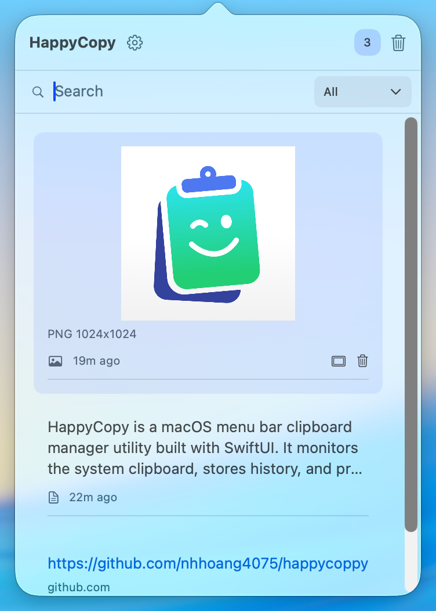

<div align="center">


<br></br>

[](https://www.apple.com/macos) [](https://swift.org) 

</div>

## Overview

A lightweight, native macOS clipboard manager that lives in your menu bar. HappyCopy automatically saves your clipboard history and lets you quickly access previously copied items.

<div align="center">
    
</div>

## Features

- **Clipboard History**: Automatically tracks and stores text, URLs, and images copied to your clipboard
- **Menu Bar Access**: Quick access through a clean, native menu bar interface
- **Smart Type Detection**: Automatically recognizes and categorizes text, URLs, and images
- **Search & Filter**: Quickly find items with built-in search and type filtering
- **Image Support**: Full support for images with preview, format detection, and automatic compression for large files
- **Configurable Storage**: Set maximum items and auto-delete periods
- **Launch at Login**: Optional system startup integration
- **Notifications**: Get notified when your clipboard is nearing capacity
- **Multi-language**: Support for English and Vietnamese

## Requirements

- macOS 14.6 or later

## Installation

### From Source

1. Clone the repository:

```bash
git clone https://github.com/nhhoang4075/happycopy.git
```

2. Open the project in Xcode

3. Build and run (⌘R) or archive for distribution

## Usage

1. **Launch HappyCopy**: Click the sparkle clipboard icon in your menu bar
2. **View History**: Click the menu bar icon to see your clipboard history
3. **Copy Item**: Click any item to copy it back to your clipboard
4. **Search**: Use the search bar to filter items by content
5. **Filter**: Use the dropdown to filter by type (All/Text/Image/URL)
6. **Preview Images**: Hover over images and click the preview button to see full size
7. **Delete Items**: Hover over items to reveal the delete button, or use the trash icon to clear filtered items/all history
8. **Settings**: Click the gear icon to configure preferences

## Configuration

### Settings Options

- **Launch at Login**: Automatically start HappyCopy when you log in
- **Show Notifications**: Receive alerts when clipboard is near capacity
- **Maximum Items**: Choose how many items to keep (50/100/200/500)
- **Auto-delete After**: Automatically remove old items after selected period (1/3/7/30 days or never)

### Storage

Clipboard history is stored locally. Images larger than 5MB are automatically compressed to JPEG format to save space.

## Privacy

HappyCopy stores all clipboard data locally on your Mac. No data is transmitted over the network or shared with third parties. The app runs in a sandboxed environment for enhanced security.
